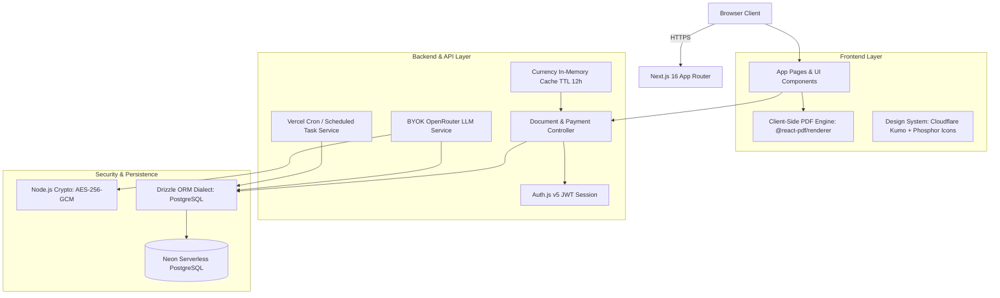
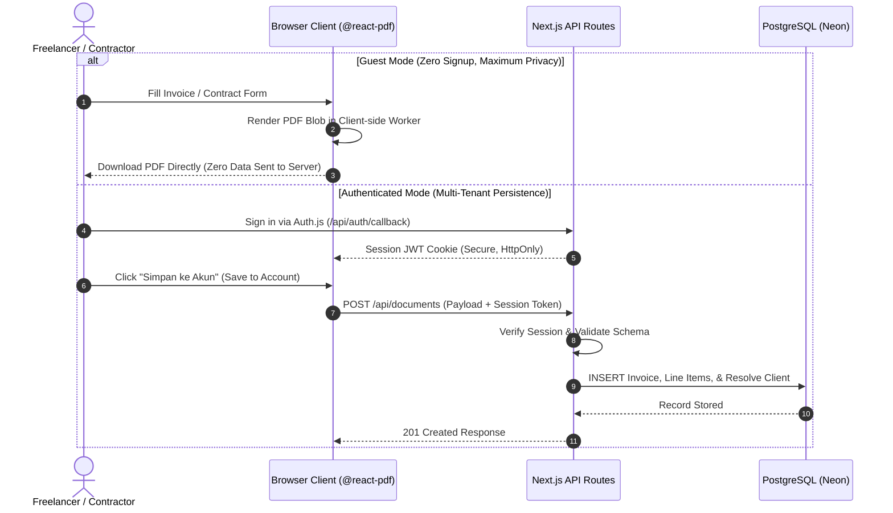

# SerbaSerbi System Architecture & Engineering Specifications

Technical engineering documentation detailing system boundaries, data flow diagrams, cryptographic security models, and the multi-tenant architectural design of SerbaSerbi.

---

## 1. High-Level Architecture Overview

SerbaSerbi follows a **Modular Monolith** architecture built on Next.js 16 App Router (React Server Components, Client Components, and Edge/Node API Routes).

---

## 2. Dual Operating Modes (Guest Mode vs Authenticated Multi-Tenant)

---

## 3. Cryptographic Security Model (BYOK - Bring Your Own Key)

To satisfy data privacy requirements and prevent storing third-party API credentials in plaintext:

1. **Encryption at Rest:**
   - User OpenRouter API keys are encrypted using the authenticated `AES-256-GCM` algorithm.
   - Every encryption operation generates a cryptographically random, unique 96-bit Initialization Vector (IV).
   - Database storage format in `openrouter_api_key_encrypted`: `iv_hex:auth_tag_hex:ciphertext_hex`.
2. **Decryption at Runtime:**
   - Decryption occurs transiently in server memory only when an authenticated user invokes `/api/ai/expand-description` or `/api/ai/suggest-clauses`.
   - The full API key is never exposed to the client interface; only masked strings (e.g., `sk-or-v1-abc...9xyz`) are displayed.

---

## 4. Currency Exchange Rate Caching (USD / IDR)

- An in-memory cache layer maintains timestamped exchange rate records.
- Incoming requests check if the cached value is within its 12-hour (43,200-second) Time-To-Live (TTL).
- **Cache Hit:** Serves the cached exchange rate immediately with 0 ms external network latency.
- **Cache Miss / Expiry:** Fetches fresh exchange rates asynchronously, updates the cache, and serves the caller.
- Outgoing responses include edge caching headers: `Cache-Control: s-maxage=43200, stale-while-revalidate=3600`.
